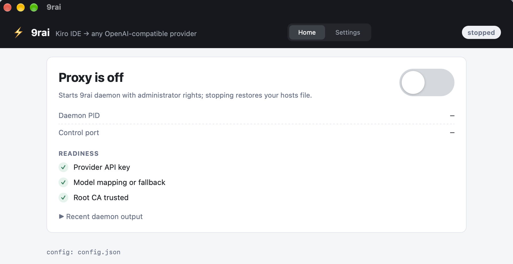
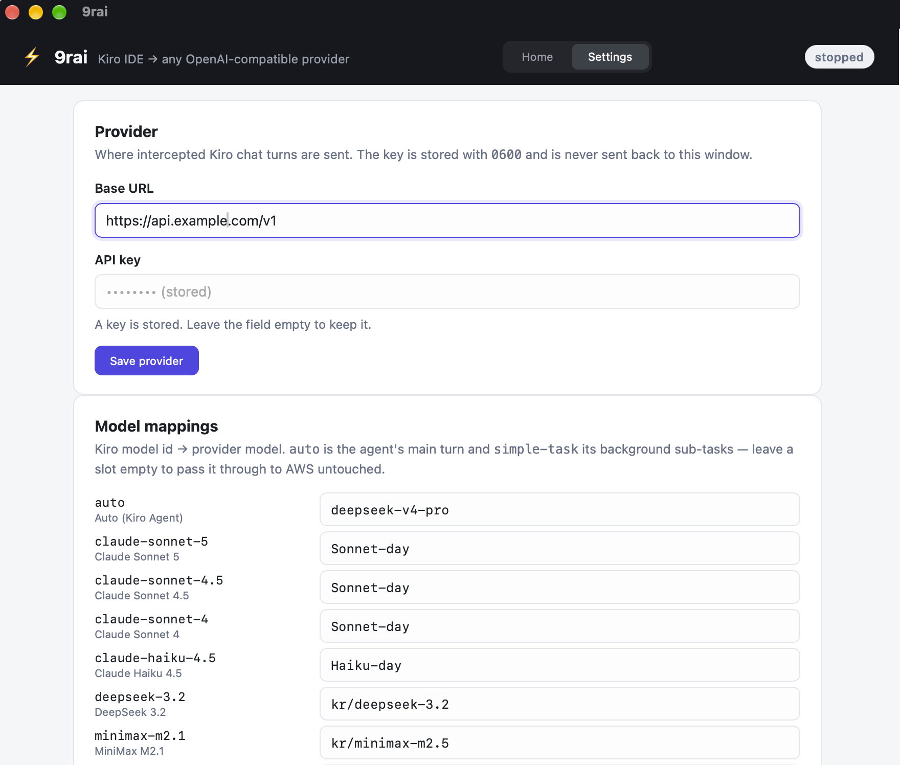

<div align="center">

# ⚡ 9rai

**Transparent, zero-patch MITM proxy engine connecting Kiro IDE to custom OpenAI-compatible AI providers.**

[](https://opensource.org/licenses/MIT)
[](https://www.rust-lang.org)
[](#platform-support)
[](#development--testing)

[Features](#-features) • [How It Works](#-how-it-works) • [Quick Start](#-quick-start) • [CLI Reference](#-cli-reference) • [Architecture](#-architecture) • [Desktop GUI](#-desktop-gui) • [Security](#-security--privacy)

</div>

---

## 📖 Overview

**9rai** (pronounced *nine-rai*) is a high-performance, lightweight local proxy built in Rust that intercepts AI requests from **Kiro IDE** (AWS CodeWhisperer protocol) and seamlessly routes them to any OpenAI-compatible API endpoint (such as [9Router](https://github.com/decolua/9router), OpenAI, OpenRouter, DeepSeek, Ollama, or custom self-hosted LLMs).

No binary patching, no disassembling, and no IDE hacks required. 9rai operates transparently at the network layer using local root CA minting and hosts-file hijacking.

---

## ✨ Features

- 🎯 **Zero Patching**: Leaves Kiro IDE binaries untouched. Works purely via loopback DNS (`/etc/hosts`) and TLS interception.
- ⚡ **High Performance & Low Latency**: Written in Rust with `tokio`, `hyper` v1, and `rustls`. Near-zero overhead.
- 🔄 **Bidirectional Protocol Translation**:
  - Translates CodeWhisperer JSON request payloads into standard OpenAI `chat/completions` schema.
  - Translates streaming SSE (`text/event-stream`) back into AWS binary `vnd.amazon.eventstream` frames with CRC32 verification.
- 🧠 **Native Reasoning & Thinking Support**: Extracts `<thinking>` blocks and native reasoning deltas, routing them to Kiro's internal reasoning streams.
- 🛠️ **Tool & Function Calling**: Full support for tool execution turns, tool results serialization, and multi-turn history.
- 🛡️ **Transparent Passthrough**: Unmapped models, authentication, telemetry, and non-chat AWS endpoints are cleanly forwarded to the real AWS upstreams via upstream DNS bypass (`8.8.8.8`).
- 🧹 **Safe Teardown & Host Recovery**: Injects loopback entries on startup and restores `/etc/hosts` on graceful shutdown (`Ctrl+C`, GUI `/stop`, or service error). A hard kill (`SIGKILL`) cannot be caught by any process — see *Limitations* below.

---

## 🔄 How It Works

```
┌────────────────────────────────────────────────────────┐
│                        Kiro IDE                        │
└───────────────────────────┬────────────────────────────┘
                            │ HTTPS (:443)
                            │ [Hosts hijacked to 127.0.0.1]
                            ▼
┌────────────────────────────────────────────────────────┐
│                   9rai Proxy Engine                    │
│                                                        │
│  1. Terminate TLS with on-the-fly leaf cert (Root CA)  │
│  2. Inspect HTTP headers & path:                       │
│     ├── Non-chat / Unmapped Model ──► Upstream AWS     │
│     │                                (DNS: 8.8.8.8)    │
│     └── Mapped Chat Request                            │
│           │                                            │
│           ├─► Translate Kiro Body -> OpenAI Format     │
│           ├─► Stream from Provider (SSE)               │
│           └─► Encode SSE -> AWS EventStream Binary     │
└───────────────────────────┬────────────────────────────┘
                            │ HTTP(S)
                            ▼
┌────────────────────────────────────────────────────────┐
│               AI Provider / Router                     │
│    (9Router, OpenAI, OpenRouter, DeepSeek, etc.)       │
└────────────────────────────────────────────────────────┘
```

---

## 🚀 Quick Start

### 1. Prerequisites

- **Rust toolchain** (version 1.98.0+ recommended):
  ```bash
  curl --proto '=https' --tlsv1.2 -sSf https://sh.rustup.rs | sh
  ```
- **Administrative / Root Privileges**:
  Required to bind port `:443` and temporarily modify the system hosts file / trust store.

### 2. Build

Clone the repository and build the CLI executable:

```bash
git clone https://github.com/TuNa-eTech/9rai-kiro.git
cd 9rai-kiro

cargo build --release --bin 9rai
```
The compiled binary will be located at `target/release/9rai`.

---

### 3. Setup Provider & Model Mappings

Configure your AI provider endpoint (e.g., [9Router](https://github.com/decolua/9router), OpenAI, or OpenRouter) and map your Kiro models:

```bash
# Set provider base URL and API key
./target/release/9rai config set-provider \
  --base-url "https://api.openai.com/v1" \
  --api-key "sk-your-api-key-here"

# Map Kiro's "auto" model to your chosen provider model
./target/release/9rai config map \
  --kiro-model "auto" \
  --provider-model "gpt-4o"

# (Optional) Set a fallback model for any unmapped models
./target/release/9rai config set-default \
  --provider-model "gpt-4o"

# Inspect current configuration
./target/release/9rai config show
```

> [!NOTE]
> Configuration is stored securely with `0600` permissions at:
> - **macOS**: `~/Library/Application Support/9rai/config.json`
> - **Windows**: `%APPDATA%\9rai\config.json`
> - **Linux**: `~/.local/share/9rai/config.json`

---

### 4. Initialize Local Root CA

Initialize and verify the local Root CA:

```bash
./target/release/9rai ca init
./target/release/9rai ca status
```

---

### 5. Run the Proxy Daemon

Start the proxy daemon. Because it binds to port `:443` and modifies the OS hosts file, run with `sudo` (or Administrator on Windows):

```bash
sudo ./target/release/9rai daemon
```

When started, 9rai will:
1. Ensure the Root CA is trusted in the system store.
2. Route Kiro domains (`runtime.us-east-1.kiro.dev`, `codewhisperer.us-east-1.amazonaws.com`, `q.us-east-1.amazonaws.com`) to `127.0.0.1`.
3. Intercept Kiro IDE chat requests and translate them to your provider.
4. Cleanly restore `/etc/hosts` upon pressing `Ctrl+C`.

---

## 💻 CLI Reference

The CLI binary `9rai` provides utility commands for automation, offline testing, and CA management:

```
Headless driver for the 9rai MITM engine

Usage: 9rai <COMMAND>

Commands:
  daemon    Run the interception proxy: set up CA + hosts, serve until Ctrl-C, then restore
  config    Show or set the provider configuration and model mappings
  ca        Root CA management
  request   Convert a captured CodeWhisperer request body into the OpenAI request we would send
  response  Convert a captured OpenAI SSE transcript into the EventStream bytes Kiro would receive
  verify    Decode an EventStream file and print one line per frame
  help      Print this message or the help of the given subcommand(s)
```

### Config Subcommands
```bash
9rai config show                                             # Show config (API key redacted)
9rai config set-provider --base-url <URL> --api-key <KEY>    # Set provider endpoint
9rai config map --kiro-model <KIRO> --provider-model <MODEL> # Map model
9rai config set-default --provider-model <MODEL>             # Set default fallback model
```

### CA Subcommands
```bash
9rai ca init                               # Generate or verify local Root CA
9rai ca status                             # Check if Root CA is trusted by OS
9rai ca leaf --domain <DOMAIN> --out-dir <DIR> # Mint a test leaf cert and key
```

### Offline Inspection & Fixtures
You can test the translation pipeline without spinning up the proxy using files in `fixtures/`:

```bash
# Convert a CodeWhisperer JSON body to an OpenAI JSON request
cargo run --bin 9rai -- request --input fixtures/req.json --model gpt-4o

# Convert an OpenAI SSE dump to AWS EventStream binary
cargo run --bin 9rai -- response --input fixtures/resp.sse --output fixtures/out.bin --model gpt-4o

# Decode and inspect EventStream frames
cargo run --bin 9rai -- verify --input fixtures/out.bin
```

---

## 🏗️ Architecture

```
9rai-kiro/
├── apps/
│   └── desktop/          # Tauri control panel: config, CA, daemon lifecycle + logs
├── crates/
│   ├── cli/              # '9rai' headless binary (clap, tracing)
│   └── core/             # 'nine-rai-core' engine
│       ├── appconfig.rs  # Config persistence & secure file permissions
│       ├── cert/         # Root CA generation, dynamic leaf minting & trust store
│       ├── dns.rs        # Upstream DNS resolver bypassing local hosts
│       ├── eventstream.rs# AWS EventStream encoder/decoder & CRC32
│       ├── hosts.rs      # System hosts file atomic injection & cleanup
│       ├── mapping.rs    # Model mapping logic
│       ├── privilege.rs  # Privileged operations batch runner
│       ├── provider.rs   # Upstream OpenAI client & streaming
│       ├── proxy/        # Hyper TLS server, SNI parser, route classifier, passthrough
│       ├── session.rs    # Interception session lifecycle
│       └── translate/    # Request/Response/SSE/Thinking blocks translation
└── fixtures/             # Sample requests & responses for testing
```

---

## 🖥️ Desktop GUI

`apps/desktop` is a Tauri control panel over the same engine the CLI drives. It never touches
`/etc/hosts` or the trust store itself: configuration and the root CA go through the same
`nine-rai-core` code as `9rai config` and `9rai ca`, and the privileged half is the actual
`9rai daemon` process — launched through the OS elevation prompt and then driven over its
loopback control channel (`GET /status`, `POST /stop`).

### Screenshots

| Home | Settings |
| :---: | :---: |
| [](screenshots/home.png) | [](screenshots/settings.png) |

### Running from source

```bash
# 1. Build the CLI the GUI supervises (it looks for `9rai` next to itself, then on PATH)
cargo build --bin 9rai

# 2. Frontend toolchain, once
cd apps/desktop && npm install

# 3. Dev loop with hot reload — or a bundled app
npm run tauri dev
npm run tauri build
```

Set `NINE_RAI_CLI=/path/to/9rai` to point the GUI at a specific binary.

### What it drives

Two views: **Home** — a single on/off switch over the daemon, a readiness checklist (with
one-click CA auto setup), and the recent daemon output — and **Settings** — provider, mappings,
root CA, and the full log.

| Panel | Backing code |
| :--- | :--- |
| Provider endpoint + API key | `AppConfig` (`config.json`; the key is stored `0600` and never sent back to the window) |
| Model mappings + fallback | `ModelMap`, preset with the Kiro model ids the IDE actually sends (`auto`, `simple-task`, `claude-*`, `gpt-5.6-*`, `deepseek-3.2`, `minimax-m2.1`) |
| Root CA — fingerprint, trust, one-click auto setup | `CertStore` + `cert::trust::is_installed` + `9rai elevated --ops` |
| Start / Stop / state / PID / log | `9rai daemon` over the control channel |

The mapping table is built from `nine_rai_core::config::KIRO_MODEL_SLOTS`, ported from 9router's
verified MITM dumps: the agent mode sends `auto` for the main turn and `simple-task` for
background sub-tasks, so those two are always offered even though they never appear in the
IDE's model picker. An unmapped slot passes through to AWS untouched.

When the CA is missing or untrusted, the checklist offers **auto setup**: one click mints the
CA and installs it into the system trust store with a single administrator prompt (the same
batch the daemon runs on first start, via the hidden `9rai elevated` entry point).

The daemon pairing (control port + per-session bearer token) is persisted `0600` in the data
directory, so reopening the window re-attaches to a daemon that is still running instead of
orphaning it with the hosts file hijacked. A stale pairing (daemon killed) is detected and
discarded on the next status poll.

---

## 🔒 Security & Privacy

- **Local Certificate Authority**:
  The Root CA is generated locally on your machine with **ECDSA P-256** and its private key is written with `0600` permissions from creation. The private key is never exported or shared.
- **Loopback-only listener**:
  The proxy binds only `127.0.0.1` and `[::1]` (never `0.0.0.0`) and only mints certificates for the three hijacked Kiro hosts.
- **Provider TLS stays verified**:
  Calls to your provider are validated against the OS trust store; passthrough to AWS upstreams is validated against the bundled webpki roots.
- **Selective Interception**:
  Only specified Kiro IDE endpoints and explicitly mapped models are intercepted. Unmapped traffic passes through untouched.
- **Zero Telemetry**:
  9rai contains no tracking, telemetry, or remote analytics. Everything runs 100% locally.

### Limitations

- **`SIGKILL` strands the hosts hijack.** If the daemon is force-killed, the `# BEGIN 9rai` block stays in `/etc/hosts` and Kiro loses connectivity. Recovery: run `sudo 9rai daemon` once more and stop it normally, or remove the block manually.
- **Control channel** (`--control-port`): bound to `127.0.0.1` with a per-session bearer token; intended for the GUI, offers `GET /status` and `POST /stop`.

---

## 🖥️ Platform Support

| Operating System | Architecture | Status |
| :--- | :--- | :---: |
| **macOS** | Apple Silicon (`aarch64`) / Intel (`x86_64`) | ✅ Supported |
| **Windows** | Windows 10/11 (`x86_64`) | ✅ Supported |
| **Linux** | `x86_64`, `aarch64` | ⚠️ Compiles; trust-store install must be done manually (no automation yet) |

> Config and the root CA always resolve to the **invoking user's** data directory — running
> the daemon with `sudo` does not split state into root's home.

---

## 🧪 Development & Testing

Run all unit and end-to-end tests:

```bash
cargo test                 # core + CLI (the default member set)
cargo test -p nine-rai-desktop   # the desktop app (Tauri toolchain, built on demand)
```

Check code style and linting:

```bash
cargo clippy --workspace --all-targets
```

---

## 🗺️ Roadmap

- [x] **M1–M4**: Core MITM engine, dynamic CA minting, request/response translation, EventStream framing, in-process E2E (mock Kiro client + mock upstreams, h1 and h2).
- [ ] **M5**: Verification against the real Kiro IDE on macOS and Windows.
- [x] **M6**: Desktop GUI application powered by Tauri (`apps/desktop`), driven over the daemon's control channel.
- [ ] **M7**: Support for additional IDE extensions and custom prompt transforms.

---

## 📄 License

This project is licensed under the [MIT License](LICENSE).
